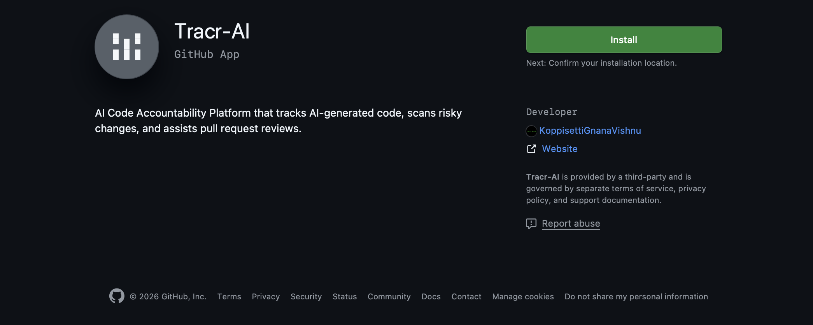
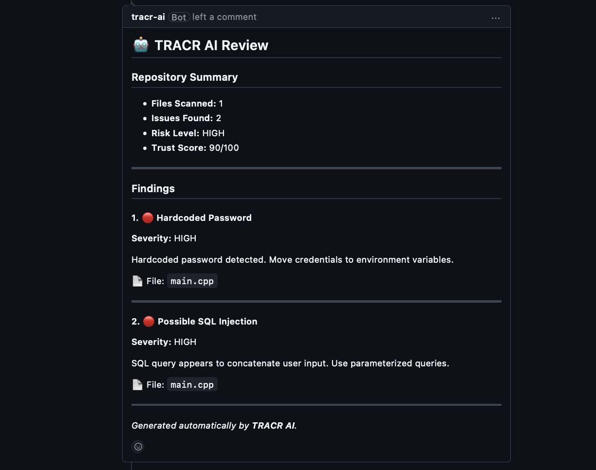
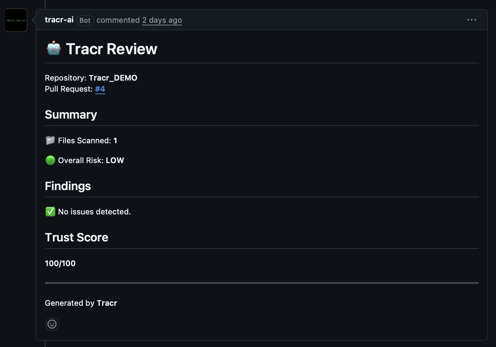

# 🛡️ Tracr

### GitHub App for Pull Request Security Analysis & Trust Scoring

Tracr automatically analyzes Pull Requests, detects security vulnerabilities, evaluates repository risk, and generates actionable review reports before code is merged.

[](https://github.com/apps/tracr-ai)

🚀 **Install & Test Tracr**
https://github.com/apps/tracr-ai

---

# 🚀 Try Tracr Right Now

No local setup required.

### 1️⃣ Install the GitHub App

Visit:

https://github.com/apps/tracr-ai



### 2️⃣ Select a Repository

Install Tracr on any personal or organization repository.

### 3️⃣ Create a Pull Request

Add vulnerable code such as:

```javascript
const password = "admin123";

const query =
  "SELECT * FROM users WHERE id = " + userId;
```

### 4️⃣ Watch Tracr Review Your Code

Tracr automatically:

* Detects security vulnerabilities
* Evaluates repository risk
* Generates Pull Request findings
* Calculates trust scores
* Posts review reports directly to GitHub

---

# 🧪 Test Tracr Yourself

Tracr is publicly available as a GitHub App and can be tested on your own repositories.

### Sample Test

Create a Pull Request containing:

```javascript
const password = "admin123";

const query =
  "SELECT * FROM users WHERE id = " + userId;
```

### Expected Findings

* Hardcoded Password
* Possible SQL Injection

Tracr will automatically analyze the Pull Request and generate a review report.

---

# 📖 Why Tracr?

Code reviews are essential for maintaining software quality and security, but manual reviews are often:

* Time-consuming
* Inconsistent
* Difficult to scale
* Prone to human oversight

Security issues such as hardcoded credentials and unsafe query construction can easily reach production environments.

Tracr acts as an automated first-pass security reviewer that analyzes Pull Requests and highlights potential risks before code is merged.

---

# ⚡ Key Features

## GitHub Integration

* Public GitHub App Installation
* Pull Request Monitoring
* GitHub Webhook Integration
* Multi-Repository Support

## Security Analysis

* Hardcoded Credential Detection
* SQL Injection Detection
* Repository Risk Assessment
* Trust Score Generation

## Developer Experience

* Automated Pull Request Reviews
* Actionable Security Recommendations
* Zero Configuration Testing
* GitHub-Native Workflow

---

# 🌍 Language-Agnostic Security Scanning

Tracr performs pattern-based security analysis on source code changes and is not restricted to a single programming language.

### Validated Languages

* ✅ JavaScript
* ✅ C++

### Current Detection Rules

* Hardcoded Passwords
* Hardcoded Credentials
* SQL Injection Patterns
* Repository Risk Classification

Additional language validations and security rules are actively being expanded.

---

# 🔍 How Tracr Works

```text
Developer Creates Pull Request
                │
                ▼
        GitHub Webhook Event
                │
                ▼
           Tracr Backend
                │
                ▼
      Security Analysis Engine
                │
                ▼
        Vulnerability Scanner
                │
                ▼
        Risk Evaluation Layer
                │
                ▼
       Trust Score Generation
                │
                ▼
      Pull Request Review Report
```

---

# 📸 Real Pull Request Reviews

## Vulnerable Pull Request

Tracr successfully detected security vulnerabilities in a Pull Request containing:

* Hardcoded Password
* Possible SQL Injection

### Screenshot



### Example Output

```text
Files Scanned: 1

Overall Risk: HIGH

Findings:
- Hardcoded Password
- Possible SQL Injection

Trust Score: 90/100
```

---

## Clean Pull Request

Tracr correctly identified a clean Pull Request with no security findings.

### Screenshot



### Example Output

```text
Files Scanned: 1

Overall Risk: LOW

No issues detected

Trust Score: 100/100
```

This demonstrates:

* ✅ Vulnerability Detection
* ✅ Low False Positive Behavior

---

# 🧪 Validation Results

Tracr has been successfully tested using:

* ✅ Independent GitHub Accounts
* ✅ Public GitHub App Installation
* ✅ External Repositories
* ✅ Pull Request Webhooks
* ✅ JavaScript Projects
* ✅ C++ Projects
* ✅ Vulnerable Pull Requests
* ✅ Clean Pull Requests
* ✅ Automated Review Generation
* ✅ Trust Score Evaluation

---

# 🏗️ System Architecture

```text
GitHub Repository
        │
        ▼
    GitHub App
        │
        ▼
  Webhook Listener
        │
        ▼
    Tracr Backend
        │
 ┌──────┴──────┐
 ▼             ▼
Scanner      Database
Engine
 ▼
Review Generator
 ▼
Trust Score Engine
 ▼
GitHub Pull Request Review
```

---

# 🛠️ Tech Stack

### Backend

* Node.js
* Express.js

### GitHub Integration

* GitHub Apps
* Octokit
* GitHub Webhooks

### Database

* SQLite

### Deployment

* Render

---

# 📂 Project Structure

```text
Tracr/
├── src/
│   ├── routes/
│   ├── scanners/
│   ├── services/
│   ├── github/
│   └── database/
├── reviews/
├── public/
├── docs/
│   └── images/
└── README.md
```

---

# 🚀 Local Development

```bash
git clone https://github.com/KoppisettiGnanaVishnu/Tracr.git

cd Tracr

npm install

npm start
```

Configure the required environment variables before running the application.

---

# 🚧 Roadmap

### Planned Enhancements

* Inline GitHub Review Comments
* Additional Security Rules
* Python Validation
* Java Validation
* AI-Assisted Code Understanding
* Historical Risk Analytics
* Team Security Dashboards
* Advanced Trust Scoring Models

---

# 🤝 Contributing

Contributions, suggestions, and feedback are welcome.

1. Fork the repository
2. Create a feature branch
3. Submit a Pull Request

---

# ⭐ Install & Test Tracr

Ready to try it yourself?

### GitHub App Installation

👉 https://github.com/apps/tracr-ai

Install Tracr on a repository, create a Pull Request, and experience automated security reviews directly within GitHub.

If you find Tracr useful, consider giving the repository a ⭐.
